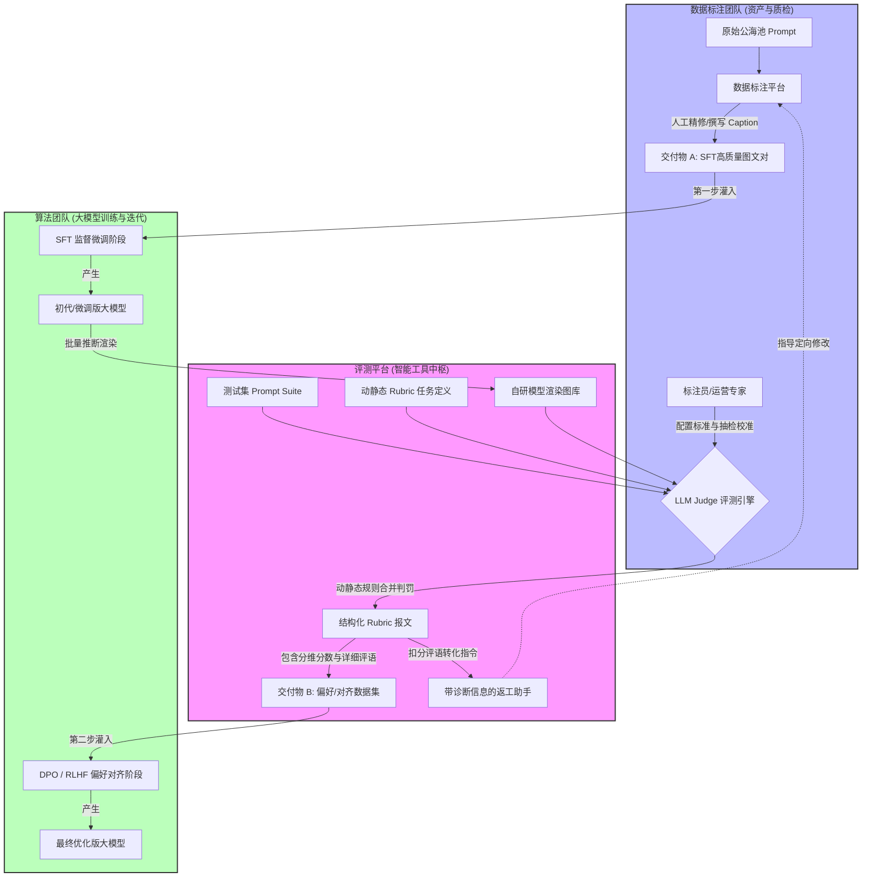

# 文生图（T2I）全周期数据协同指南：数据标注、LLM-Judge评测与算法团队深度协作模式全景解构

---

## 一、 引言：多模态数据工程的业务全景

在文生图（Text-to-Image, T2I）大模型的发展历程中，决定模型生死存亡的要素已从单纯的“算力参数大比拼”全面转向了“高质量真值数据（Ground Truth）的精细化喂养”**。在这个数据飞轮中，**数据标注团队**绝对不是传统的“劳动密集型流水线”，而是大模型审美、空间理解与指令遵循能力的**资产塑造者与质量卡控中枢。

为了让项目经理（PM）、运营专家、标注人员与算法工程师能够在同一套话语体系下高效协作，本指南将全盘解构文生图场景下的业务全景、数据流转全貌，并针对“基于评测 Rubric 结果接入强化学习（RL）提升标注质量”这一前沿方向给出战略落地建议。

---

## 二、 核心概念、专业术语与三大交付边界

在进入具体的流水线之前，必须首先理清并统一行业内的专业术语。文生图数据团队的交付物并非一团乱麻，而是严格区分的“双轨制”资产。

### 2.1 交付物 A：SFT 监督微调数据集 (Supervised Fine-Tuning Dataset)

- **这是什么：** 由人类精心挑选、构图完美、光影高级的高清图像，并由标注员纯手工（或基于高阶模型润色）撰写的**极其精确、长文本描述（Image Caption）的图文对资产**。这里的图像通常来自外部艺术平台或同行顶尖模型，并非自研模型所画。
- **用于什么：** 算法团队的模型 **SFT（监督微调）阶段**。
- **提升什么：** 提升模型的“审美与画质上限”。教会模型人类世界里什么是“高级感”、“逼真的皮肤质感”、“赛博朋克画风”。

### 2.2 交付物 B：人类/AI 偏好数据集 (Preference / Feedback Dataset)

- **这是什么：** 针对一套固定的测试提示词（Prompt），由**自研的待评测大模型自己画出来的图**，再由评测平台（LLM Judge 或人工）根据多维度量表（Rubric）给出的**打分、偏好标签与错因评语**。
- **用于什么：** 算法团队的模型 **RLHF / DPO（基于人类反馈的强化学习/直接偏好优化）阶段**。
- **提升什么：** 提升模型的“听话与合规下限”。专门纠正模型的常见病，如：错别字、漏标实体、六指畸变、画面撕裂及色情暴力，让模型更听得懂人话。

### 2.3 评测输入端 Rubric 的本质澄清：任务定义模式

> ⚠️ **新手核心卡点：** 评测平台输入流中已有的 `rubric` 字段，常常让新人误以为是“已经标好的分数”。
> **正确理解：** 在实际业务场景下，输入的 `rubric` 属于**“任务定义模式”**。它不带任何分数值，只是大模型裁判（LLM Judge）在阅卷前必须阅读的**“考试大纲/打分项规则模板”**。

- **静态 Rubric（Static Rubric）：** 普适性的硬性画质底线。例如：检查人体结构是否崩坏、画面是否有严重噪点、是否包含违禁内容。
- **动态 Rubric（Dynamic Rubric）：** 评测系统根据当前 Prompt **动态拆解出的实体考题**。
- _示例：_ 针对 Prompt “戴墨镜的猫”，动态 Rubric 自动拆出两条考核点：① 图中是否有猫？② 猫是否戴了墨镜？

### 2.4 核心卡点大对齐（新手避坑问答）

- **Q：交付物 A（高质量 SFT 数据）必须要经过评测平台吗？**
- **A：不需要。** 交付物 A 的本质是“纯净的图文资产”，它不涉及自研模型生图，因此只需要在普通的【数据标注平台】进行文本打标和质检即可，无需送往用于大模型阅卷的【评测平台】。

- **Q：评测平台只存在于交付物 B 的流程里吗？**
- **A：是的。** 评测平台天然是为交付物 B（评测/RL轨）而生的。只有当自研模型吐出了作业（生成的图片），才需要评测平台调用 LLM Judge 依据动静态 Rubric 进行阅卷，产出交付物 B。

---

## 三、 业务全图景：三方协同数据流转架构

以下架构图完整展现了数据标注团队、评测平台（工具中枢）以及算法团队在日常研发中的全貌协助与数据流转路径。



---

## 四、 算法团队视角：T2I 模型从零到一的四阶段演进与数据联动

为了更深度地理解标注数据的价值，我们需要用算法训练工程师的视角，看模型是如何经历四个核心阶段从“白纸”变成“大师”的。

```
【阶段 1：开源冷启动】   -->  【阶段 2：SFT 拉高上限】 -->  【阶段 3：LLM-Judge 阅卷】 -->  【阶段 4：RLHF 锁死下限】
 灌入几十亿低清海量数据       灌入标注团队[交付物 A]        测试集生图，评测平台         算法团队消费[交付物 B]
 模型“学会生图但画得很扭曲”   模型“学会高级审美与光影”      跑出分维度 Rubric 报文       通过 DPO 纠正畸变与不听话

```

### 4.1 阶段 1：冷启动阶段（开源多模态灌入）

- **算法动作：** 算法团队直接从互联网上下载现成的开源多模态数据集（如包含几亿对图文的 LAION 库）。这些数据体量极大，但质量很脏，描述多为“淘宝同款.jpg”。
- **模型表现：** 模型通过这一阶段“开了智”，具备了将文字转化为图像的基础像素能力，但**画出来的东西极其魔幻、扭曲、没有审美**。
- **数据协同：** 此阶段**不需要**标注团队介入。

### 4.2 阶段 2：精修微调阶段（SFT 拉高上限）

- **算法动作：** 为了让模型脱离低级趣味，算法团队停下冷启动，向标注团队调取**交付物 A（SFT 高清图文对数据集）**。用数万条由人类艺术家挑选、标注员写满细节的长文本 Caption 数据去硬性微调模型。
- **模型表现：** 模型产生了质的飞跃，**学会了什么是高级感、写实皮肤质感、大片构图与复杂的色彩搭配**。模型的“美学上限”被彻底拉高。
- **数据协同：** 标注团队利用【数据标注平台】纯人工输出的高纯度资产，是该阶段的绝对燃料。

### 4.3 阶段 3：批量生图与自动化评测阶段（LLM-Judge 阅卷）

- **算法动作：** 变美后的模型开始接受考试。算法团队让该版本模型针对包含 1 万条核心复杂 prompt 的“测试集（Prompt Suite）”进行批量生图。生图结果直接送入【评测平台】。
- **系统表现：** 评测平台启动 **LLM Judge** 模块。大模型裁判一边阅读输入的“Rubric 任务定义模板”，一边看图，输出分维度的 Rubric 评分向量与详细的扣分评语。
- **数据协同：** 评测平台将 `[Prompt + 模型生成图 + Rubric 分数与评语]` 自动打包打包，转化为**交付物 B**。同时，低分报文会转化为指令，打回标注端（方案 07）指导标注员改产。

### 4.4 阶段 4：人类反馈对齐阶段（DPO / RLHF 锁死下限）

- **算法动作：** 算法团队来到评测平台后端，一键导出**交付物 B（偏好/对齐数据集）**。他们利用这些数据去训练一个奖励模型（Reward Model），或者直接使用 DPO（直接偏好优化）算法去扣动模型微调的扳机。
- **模型表现：** 损失函数开始工作，模型在微观行为上被严厉校准：“只要画出六个手指、只要漏掉墨镜，就会遭到惩罚”。经过偏好对齐后，**模型不仅画得美，而且彻底听懂了人话，消除了绝大部分畸变和逻辑死角**。模型的“行为下限”被彻底锁死。

---

## 五、 实战教学：输入端标注 vs 输出端标注的本质区别与协同

在文生图的日常作业中，标注动作根据其发生的位置，分为“输入端”和“输出端”，两者的关注点和转化目标完全不同。

| 维度         | 输入端标注 (Prompt / Caption 侧)                   | 输出端标注 (Image / Rubric 侧)                   |
| ------------ | -------------------------------------------------- | ------------------------------------------------ |
| **发生时机** | 在模型响应生图**之前**（或针对纯图片进行逆向打标） | 在模型响应生图**之后**（盯着模型画出来的图）     |
| **标注核心** | 文本的精细度、空间关系描述、实体丰富度。           | 图片与文本的对齐度、画质美观度、肢体结构。       |
| **转化目标** | 转化为 **交付物 A (SFT 资产)**，喂给模型学审美。   | 转化为 **交付物 B (偏好资产)**，喂给模型学对齐。 |

### 5.1 协同实战示例：以“一只戴墨镜的猫在霓虹灯下跳舞”为例

#### 动作一：输入端标注（生产高精 SFT）

- **场景：** 标注平台给你一张高清画师作品（一只极具未来感的猫在敲电脑）。
- **标注员动作：** 不能只写“一只猫”，必须扩写并校准为：“一张超高清数字艺术画，一只身穿红色卫衣的英国短毛蓝猫，面带严肃表情坐在机械键盘前敲击代码，背景是深夜的办公室，窗外透进蓝紫色的霓虹灯光，赛博朋克风格，精致的毛发细节。”
- **如何起作用：** 这段文本连同图片作为 **交付物 A** 喂给算法做 SFT 训练，大模型从此学会了“卫衣、英短、赛博朋克光影”的完美对应。

#### 动作二：输出端标注（评测平台 Rubric 打分）

- **场景：** 算法模型根据上述 Prompt 渲染出了图片。评测平台将图片和 Rubric 任务定义发给 LLM Judge。
- **LLM Judge 动作：** 严格按照 Rubric 规则挑刺。
- _实体核对：_ 有猫（Pass），有卫衣（Pass），等等，**“未检测到窗外的蓝紫色霓虹灯光（Fail，扣 2 分）”**。
- _结构核对：_ **“检测到猫咪的右前爪出现了 6 个脚趾，属于严重人体/动物结构崩坏（Fail，扣 3 分）”**。

- **如何起作用：** 这份带有精细扣分维度的 JSON 报文作为 **交付物 B** 交付给算法团队，算法团队通过 DPO 训练，让模型死死记住：“漏掉霓虹灯、多画脚趾是绝对错误的，下次必须改正”。

---

## 六、 场景带入：日常工作流的一天演绎

为了让团队各成员更具象地理解业务，我们来看看流水线上三个不同角色在评测平台和标注协同下的一天：

### 6.1 真实标注员（小张）的一天：从结构化录入到智能返工

- **早上 09:00：** 登录【数据标注平台】，开始生产交付物 A。他看到系统强制弹出的**结构化表单（方案 06）**，要求他必须将图片的描述拆解为“主体”、“修饰词”、“背景”、“画风”分别填写，再也无法糊弄自由文本。
- **下午 14:00：** 他的界面弹出了两条红色预警任务。这是系统发回来的**智能返工单（方案 07）**。小张点开一看，上面清晰地悬浮着 LLM Judge 跑出的微观 Rubric 评语：_“小张，你给第 45 号图片写的 Caption 漏掉了背景里的‘复古跑车’，导致后端评测对齐失败，请立即补齐。”_ 小张不需要盲目猜测，2 分钟内定向修改完成，一改通过率提升 90%。

### 6.2 评测平台运营专家（老李）的一天：规则配置与 AI 裁判教练

- **早上 10:00：** 打开【评测平台】，录入本周算法团队急需测试的“多主体空间位置关系”测试集。他熟练地在系统后台配置**静态 Rubric（方案 09）**，定义好空间重叠、遮挡关系的扣分权重。
- **下午 15:00：** 运行**评测器自身逆向校准系统（方案 11）**。老李抽检了 100 条 LLM Judge 自动跑出来的 Rubric 判罚单。他发现其中有 5 条，AI Judge 把“猫爪畸变”误判为了“完美”。老李点击“不服/改判”，人工修正为低分，并将这 5 条争议数据作为偏好对齐真值，一键启动 DPO 训练，反向微调和校准了平台自己的 AI Judge，让它明天判得更准。

### 6.3 算法模型训练工程师（阿明）的一天：从资产灌入到扣动 RL 扳机

- **上午 11:00：** 算法模型遇到瓶颈，画出的金属质感很假。阿明来到数据标注团队，调取了最新生产的 5 万条“高精金属材质 SFT 数据（交付物 A）”，直接丢进服务器，拉高模型的画质上限。
- **下午 17:00：** 新模型微调出来了，阿明急需知道它有没有变听话。他一键触发评测流水线，1 万张测试图迅速被平台吞吐。半小时后，阿明在后端直接导出纯净的**结构化 Rubric 偏好报文（交付物 B）**，直接开始运行 DPO 强化学习脚本。看着雷达图上“指令遵循度”指标应声上涨，阿明露出了满意的微笑。

---

## 七、 战略前沿：基于“Rubric 得分 + 强化学习（RL）”的平台提效 TOP 3 优先方案

结合团队目前的探索方向——**想在 Rubric 评分结果后面接入一条 RL 路径，来全面提升数据标注团队的交付质量与评估精度**。在全系列 15 个探索方案中，以下 3 个方案完全基于 **“Rubric 报文特征 + RL/Bandit 算法”** 强力咬合，属于必须优先排期落地的 TOP 3 核心方案。

### 👑 TOP 1 方案：方案 11 —— 评测器自身逆向校准系统

- **涉及的 RL 算法：** DPO (Direct Preference Optimization) / PPO 强化学习微调。
- **与 Rubric 的咬合方式：** 收集标注员或人类专家对 LLM Judge 的“打分不服申诉”和最终的“人类专家仲裁结果”，将人类专家的多维 Rubric 裁决作为**绝对正确的偏好 Reward（奖励信号）**。
- **为什么第一优先（落地理由）：** **这是标注团队自身的“强化学习圣杯”**。要用 AI Judge 提升数据质量，前提是 AI 裁判自己不能有幻觉、尺度不能漂移。通过 RL 反向微调 LLM Judge，能以极低的人力抽检成本，置信地把住全盘数据资产的自动化质检红线。

### 🥈 TOP 2 方案：方案 14 —— 微观流程收益路由器

- **涉及的 RL 算法：** Contextual Bandit (上下文多臂老虎机) 在线强化学习。
- **与 Rubric 的咬合方式：** 将样本当前由 LLM Judge 跑出的**多维 Rubric 分数向量（如：对齐 2分，美学 4分，畸变 1分）作为上下文特征（Context）**。路由器的 Policy 运行 Bandit 算法，实时在“直接通过”、“原人返工”、“高级专家二审”等动作之间寻找质量增量最大、金钱成本最低的帕累托最优解。
- **为什么第二优先（落地理由）：** **这是实现标注效益高 ROI 调度的终极算法内核**。它能彻底抛弃刚性死板的人工排班，用强化学习根据错题的严重程度动态分流样本。让简单的错误自动走自动化返工（方案 07），让极其致命的坏例升级给高薪专家，用算力套利人力，死守交付质量。

### 🥉 TOP 3 方案：方案 01 —— Prompt 自动精修器

- **涉及的 RL 算法：** 基于 PPO 或 DPO 的大语言模型提示词扩写 Policy 优化。
- **与 Rubric 的咬合方式：** 标注员在前端输入粗糙的初始描述，扩写模型暗中将其扩写。扩写后的 Prompt 送去生图，**评测平台输出的最终 Rubric 总分或对齐度得分，直接作为该扩写模型的在线在线奖励（Reward Signal）**。
- **为什么第三优先（落地理由）：** **这是利用评测结果反哺、自动化量产高质量交付物 A（SFT 资产）的提效利器**。通过强化学习，让扩写模型疯狂迎合下游 Rubric 的高分偏好。标注员只需要输入一句大白话，RL 飞轮就能自动将其洗练为富含空间、画风细节的顶级 Caption，实现交付资产价值的阶跃。

---

## 八、 总结：面向新人的核心要点复盘

对于刚刚加入多模态数据团队的新人而言，以下三个高频误区与核心概念必须反复温习：

1. **分清“教材”与“试卷”：**
   不要把给算法微调用的高精图文对（交付物 A）和评测自家模型生图表现的偏好打分（交付物 B）混为一谈。前者我们负责提供标准示范，后者我们负责扮演严格的判卷官。
2. **Rubric 不是分数，是规则：**
   在进入评测系统时，Rubric 是一份“动静态结合的考试大纲”。LLM Judge 的天职是阅读这份大纲，然后去扣模型生成图的细节。
3. **评测是为了更好的生产：**
   评测平台输出的 Rubric 报文不仅仅是一份给下游看冷冰冰的报告。通过**微观返工助手（方案 07）**、**宏观规范重写（方案 04）**以及**强化学习智能调度（方案 14）**，这些评测结果会化作反向纠错的强大电流，自动化地逼迫整条标注流水线向着高 ROI、高纯度交付的目标疯狂进化。
