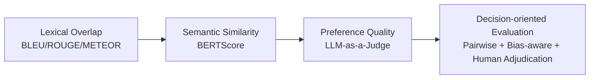
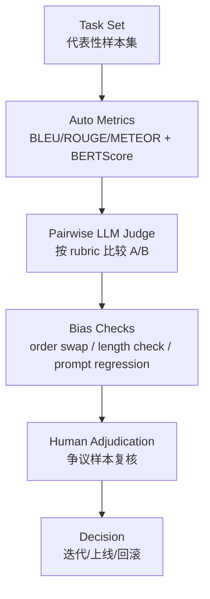

# Day41 综合总结报告：从 Overlap 到 LLM-as-a-Judge 的评测认知转折

## 1. Background & Goal

Day41 位于本轮 evaluation learning path 的关键转折点：我们已经完成 BLEU / ROUGE / METEOR（overlap 系）与 BERTScore（semantic similarity）学习，开始进入 LLM-as-a-Judge 与 pairwise preference 的现代评测范式。  
这意味着评测对象从“文本是否像参考答案”逐步转向“回答是否在任务上更好、更可靠、更可用于决策”。

本文要回答的不是“哪个指标最先进”，而是三个工程问题：

1. 为什么 overlap metrics 在开放式生成场景下不再充分；
2. 为什么 semantic similarity 进步明显但仍不足以覆盖 correctness / reasoning / utility；
3. 为什么现代评测必须把 preference、pairwise、bias management、calibration、reproducibility 作为主轴。

> 本文定位：方法论总结 + 工程认知总结；不是 benchmark 复现，也不是论文综述。

---

## 2. Executive Summary

Day41 的高密度结论可以压缩为 5 条：

1. **overlap != quality**：BLEU/ROUGE/METEOR 仍有价值，但更像“表面一致性信号”，不是开放式任务质量真值。  
2. **semantic similarity != correctness**：BERTScore 能减少改写惩罚，但不能直接保证事实正确、推理成立、风险可控。  
3. **pairwise > absolute scoring（稳定性层面）**：相对比较通常比绝对打分更抗尺度漂移，更贴近真实模型迭代决策。  
4. **judge is proxy, not truth**：LLM Judge 提供高吞吐偏好信号，但本质仍是代理评审，必须做偏差控制与校准。  
5. **evaluation is decision-making**：现代评测不是追求单一分数，而是构建“可解释、可复核、可校准”的证据系统，服务模型/产品选择。

---

## 3. Evaluation Evolution：BLEU → ROUGE → METEOR → BERTScore → LLM Judge

核心不是“指标列表”，而是“评测对象发生了什么变化”。

### 3.1 演进主线

### 3.2 每一代解决了什么，又留下了什么

| 阶段 | 代表方法 | 主要解决的问题 | 仍然存在的问题 | 对真实决策意味着什么 |
|---|---|---|---|---|
| Lexical overlap | BLEU / ROUGE / METEOR | 提供低成本、可复现、可批量比较的自动分数 | 对改写敏感；容易把“像参考答案”误当“高质量” | 适合做底线监控，不适合单独决定模型优劣 |
| Semantic similarity | BERTScore | 缓解同义改写惩罚，提升语义层鲁棒性 | 语义像不等于事实对、推理对、任务完成好 | 可作为语义对齐证据，但不能替代质量判决 |
| Preference quality | LLM Judge（pointwise/pairwise） | 能按 rubric 评估 usefulness/correctness/style 等多维质量 | Judge 有偏差、对 prompt 敏感、可漂移 | 适合做“近人类偏好”的决策信号，但需校准与审计 |

### 3.3 关键理解

- BLEU/ROUGE/METEOR 关注“字面重合”；
- BERTScore 关注“语义接近”；
- LLM Judge（尤其 pairwise）关注“同任务下哪个答案更好”。

这条链路的本质是：评测从 **text matching** 走向 **quality preference**，最终走向 **decision evidence**。

---

## 4. Methodology & Evaluation Philosophy

### 4.1 为什么“测什么”比“怎么算”更重要

如果目标是真实用户价值，那么评测维度必须覆盖：

- correctness（事实/结论正确性）
- reasoning quality（推理有效性）
- instruction following（任务遵循）
- helpfulness（可执行帮助）
- safety/risk（风险约束）

只有先明确“要优化的质量目标”，指标组合才有意义。否则任何高分都可能是错优化。

### 4.2 多指标组合，而不是单指标崇拜

推荐最小组合思路：

1. 自动指标（lexical + semantic）做低成本广覆盖筛查；
2. LLM Judge（优先 pairwise）做偏好判断与排序；
3. 人审做争议样本仲裁与 rubric 纠偏。

### 4.3 现代评测哲学

- **metric != truth**：所有指标都是代理，不是真相；
- **single score is dangerous**：单一分数会掩盖维度冲突；
- **evaluation serves decision-making**：评测是为“是否上线/是否回滚/是否继续迭代”提供证据，而不是产出漂亮数字。

---

## 5. Bias & Reliability（重点：现象 / 风险 / 缓解）

| Bias | 现象 | 风险 | 缓解思路 |
|---|---|---|---|
| Position bias | A/B 顺序不同导致胜负翻转 | 误把展示顺序当能力差异 | 固定做 AB/BA swap；统计 flip rate |
| Verbosity bias | 更长答案更容易获胜 | 奖励冗长而非信息密度 | rubric 明确“长度不直接加分”；长度归一审查 |
| Style bias | 文风更“像 AI 好文”更易胜出 | 忽略事实与可执行性 | 盲评 + 将 correctness 权重前置 |
| Self-enhancement bias | Judge 偏好与自身风格相近输出 | 同系模型互评失真 | 多 judge 交叉评审；必要时引入人审锚点 |
| Prompt sensitivity | judge prompt 微调导致结论波动 | 结果不可复现、不可比较 | prompt 版本化；固定模板；定期回归测试 |

### 5.1 Reliability 的工程底线

- 有 rubric 才有可解释性；
- 有 swap 才能看出位置偏差；
- 有复评/抽检才有稳定性；
- 有版本管理（prompt / judge / sampling）才有可复现性。

---

## 6. Pairwise Evaluation（重点章节）

### 6.1 Pointwise vs Pairwise

| 维度 | Pointwise（绝对打分） | Pairwise（相对比较） |
|---|---|---|
| 任务形式 | 给单答案打 1~10 | 在同题 A/B 中选更优 |
| 稳定性 | 易受打分尺度漂移影响 | 对尺度漂移更鲁棒 |
| 决策映射 | 分数高不一定可行动 | 直接回答“新版本是否更好” |
| 聚合方式 | 均分易掩盖分布 | 可做 win-rate / ranking / Elo |
| 工程可用性 | 容易“有分无结论” | 更贴近 A/B 迭代与发布决策 |

### 6.2 为什么 pairwise 更稳定

本质原因是比较任务更简单：judge 不必定义“7 分是否够好”，只需判断同题下谁更优。  
这显著降低了绝对标尺漂移（lenient/strict drift）带来的噪声。

### 6.3 为什么更接近真实选择

实际工程问题通常是：

- 新模型是否优于旧模型？
- 某策略改动是否提升用户体验？

这些都天然是 pairwise 决策问题，而不是“某答案今天是 8.2 分”。

### 6.4 为什么更适合 ranking / Elo

当 pairwise 样本积累后，可以自然构建全局偏好排序（win-rate、Elo、Bradley-Terry 类方法）。  
因此 pairwise 是从“评分”走向“决策系统化”的关键接口。

> **结论句：Pairwise 不是评测技巧，而是现代 LLM 评估中连接“质量判断”与“版本决策”的基础协议。**

---

## 7. Practical Evaluation Pipeline（MVP）

一个可落地、低依赖的现代 LLM evaluation MVP 流程：

### MVP 执行原则（工程视角）

1. **先广后深**：自动指标筛查异常，再进入 judge 深评；
2. **先比较后打分**：优先 pairwise，必要时再补 pointwise；
3. **先可复现再扩规模**：先把 prompt/rubric/采样版本固定住；
4. **先决策闭环再追求完美指标**：评测报告必须能支持下一步行动。

---

## 8. Risks & Failure Modes

| 风险 | 典型表现 | 影响 | 规避策略 |
|---|---|---|---|
| Judge drift | 同质量样本在不同时段结论变化 | 版本比较失真 | 定期锚点样本回归；监控一致性 |
| Rubric ambiguity | 评审标准含糊，理由泛化 | 结果不可解释 | rubric 原子化（正确性/完整性/安全分维） |
| Prompt sensitivity | 改一句提示词，排序变化大 | 报告不可复现 | prompt versioning + A/A 回归 |
| Overfitting to evaluator | 模型学会“讨好 judge”而非用户 | 线上体验反降 | 多评审源 + 人审抽检 + 线上指标联动 |
| Single-metric illusion | 过度依赖一个分数 | 错误决策风险高 | 多证据汇总，禁止单指标拍板 |

---

## 9. Conclusion & Next Step

Day41 的核心认知转折是：

1. 评测重心从“文本相似度”转向“任务质量偏好”；
2. 评测方法从“绝对评分”转向“相对比较 + 偏差管理”；
3. 评测目标从“产出分数”转向“支持决策”。

因此，现代 LLM evaluation 越来越像一个 **可校准的证据系统**：

- 自动指标提供底层信号；
- Pairwise Judge 提供偏好排序；
- 人审与偏差审计提供可信锚点；
- 最终服务版本迭代、发布与风险控制。

下一步（Day42+）建议聚焦：

- factuality 与 hallucination 的系统评估；
- 更稳健的 judge 系统（多 judge、一致性度量、漂移监控）；
- 将离线偏好证据与线上行为指标联动，形成闭环。

---

## 附：本报告的“现代评测演进理解”一句话版本

> 从 BLEU/ROUGE/METEOR 到 BERTScore 再到 LLM Judge，评测对象从“文本像不像”演进为“答案好不好、是否可用于决策”；而 pairwise 与 bias-aware 机制，是把评测从“打分动作”升级为“工程决策系统”的关键步骤。
