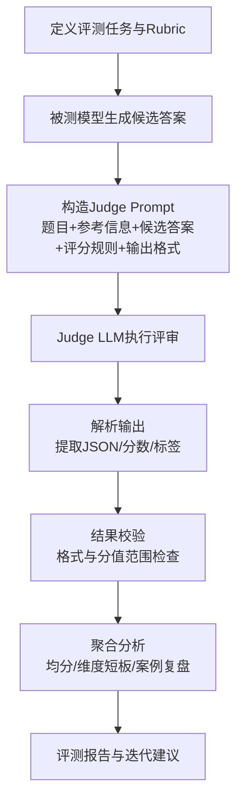

# Day 22：LLM-as-a-Judge（LaaJ）概念理解与演示（v2）

## 1) 核心概念说明

LLM-as-a-Judge（LaaJ）是指使用一个能力较强、对齐较好的大模型作为“评审者（Judge）”，对候选模型输出进行自动打分、比较与解释。

其核心思想是：将“主观质量评估”流程结构化，把原本依赖人工的判断转化为“可批量执行、可追溯、可复评”的评测流水线。

**关键要素：**
- **被测对象（Candidate Model）**：产生待评答案；
- **评审对象（Judge Model）**：依据评分规则给出维度分与结论；
- **评分规则（Rubric）**：明确“按什么标准打分”；
- **输出协议（Schema）**：结构化结果，便于后处理与统计分析。

---

## 2) 资料阅读要点（OpenCompass + MT-Bench）

### 2.1 OpenCompass：评分机制与 Prompt 模板

基于 OpenCompass 的 LLM Judge 文档，可提炼以下实践要点：

1. **输入样本组织**：通常包含问题（question/problem）、参考信息（可选）与候选答案（prediction）；
2. **Judge Prompt 模板化**：把题目、参考答案、候选答案、评分维度和输出格式约束拼接为评审提示；
3. **后处理与解析**：将评审文本解析为结构化字段（如分数、A/B 结果、结论标签）；
4. **可级联策略**：先用规则评测过滤，再把难例交给 Judge，提高评测效率。

### 2.2 MT-Bench：LaaJ 的有效性与偏差

MT-Bench/Chatbot Arena 相关研究给出两个重要结论：

1. **有效性**：强 Judge 与人类偏好具有较高一致性（可用于大规模自动评测）；
2. **局限性**：存在位置偏差（Position Bias）、冗长度偏差（Verbosity Bias）、自增强偏差（Self-enhancement Bias）等。

因此，工程上通常采用“**LaaJ 大规模自动评测 + 人工抽检校准**”的组合策略，而非完全替代人工。

---

## 3) LaaJ 标准评分流程（流程图 + 表格）

### 3.1 流程图（Mermaid）



### 3.2 流程分解表

| 阶段 | 输入 | 核心动作 | 输出 |
|---|---|---|---|
| 1. 评测设计 | 任务目标、样本集合 | 定义维度、分值区间、判定标准 | 评分 Rubric |
| 2. 候选生成 | 用户问题 + 被测模型 | 生成候选答案 prediction | 待评分答案 |
| 3. Prompt 构造 | question/reference/prediction/rubric | 模板化构造 Judge Prompt | 评审请求 |
| 4. Judge 评审 | 评审请求 | Judge 按维度评分并解释 | 原始评审文本 |
| 5. 结构化解析 | 原始评审文本 | 解析 JSON、归一化字段 | 结构化评分 |
| 6. 统计分析 | 结构化评分集合 | 计算均分、方差、薄弱维度 | 分析结论 |
| 7. 反馈迭代 | 分析结论 | 更新模型、提示词或数据 | 新一轮评测计划 |

---

## 4) 评价维度与结果格式

### 4.1 常见评价维度

- **准确性（Accuracy）**：事实是否正确，是否直接回答问题；
- **完整性（Completeness）**：是否覆盖问题关键点与边界条件；
- **逻辑性（Reasoning/Coherence）**：推理链是否连贯、无明显矛盾；
- **可读性（Readability/Clarity）**：表达是否清晰，结构是否易读；
- **安全性（Safety，可选）**：是否包含不当、误导或风险内容。

### 4.2 结构化输出格式（示例）

```json
{
  "sample_id": "day22-demo-001",
  "judge_model": "example-judge-llm",
  "overall_score": 7.2,
  "dimension_scores": {
    "accuracy": 7,
    "completeness": 6,
    "logic": 8,
    "readability": 8
  },
  "verdict": "acceptable",
  "rationale": "结论基本正确，逻辑通顺，但缺少一个关键限制条件说明。",
  "improvement_suggestion": "补充边界条件与例外场景，提升完整性。"
}
```

---

## 5) 简单示例：一次 LaaJ 评分演示

### 5.1 示例输入

- **问题（Question）**：为什么规律的有氧运动通常有助于提升心肺功能？
- **参考要点（Reference）**：有氧训练可改善心肌泵血效率、提升氧运输与利用能力，并在持续训练后提升最大摄氧量。
- **候选答案（Prediction）**：

> 有氧运动会让人出汗，所以肺活量一定会快速变大。每天跑步10分钟，所有人一周内都能明显提升心肺功能。

### 5.2 Judge Prompt（示意）

```text
你是一名严格的医学科普内容评审员。请根据以下维度对候选答案打分（1-10分）：
1) 准确性 2) 完整性 3) 逻辑性 4) 可读性

【问题】
{question}

【参考要点】
{reference}

【候选答案】
{prediction}

请仅输出 JSON：
{
  "accuracy": int,
  "completeness": int,
  "logic": int,
  "readability": int,
  "overall_score": float,
  "verdict": "acceptable|needs_improvement|poor",
  "rationale": "...",
  "improvement_suggestion": "..."
}
```

### 5.3 示例评分输出

```json
{
  "accuracy": 4,
  "completeness": 3,
  "logic": 4,
  "readability": 7,
  "overall_score": 4.5,
  "verdict": "needs_improvement",
  "rationale": "表达清楚，但将“出汗”与“心肺提升”直接等同不严谨；“所有人一周内明显提升”属于过度绝对化。",
  "improvement_suggestion": "补充生理机制（泵血效率、氧利用能力）并避免绝对化结论。"
}
```

### 5.4 结果解读

- 可读性尚可，但专业准确性不足；
- 关键机制缺失导致完整性偏低；
- 存在过度泛化语句，影响可信度；
- 后续可通过“补机制 + 限定适用范围”显著提升评分。

---

## 6) LaaJ 优势、适用场景、潜在限制

### 6.1 优势

1. **效率高**：大规模样本可快速打分；
2. **可扩展**：适合持续评测和版本回归；
3. **反馈细粒度**：不仅有总分，还有维度化改进建议；
4. **工程友好**：结构化输出便于接入数据分析流水线。

### 6.2 适用场景

- 对话助手版本迭代与回归评测；
- 开放问答、摘要、改写等主观任务质量筛查；
- 多模型 A/B 对比的快速初筛；
- 人工评审前的自动 triage（分层分流）。

### 6.3 潜在限制

1. **评审偏差**：位置/冗长度/同源偏好等偏差；
2. **Prompt 敏感**：评分规则描述不清时，结果波动大；
3. **模型漂移**：Judge 版本变化可能影响可比性；
4. **高风险领域限制**：医疗、法律等场景不能仅依赖自动评审。

### 6.4 缓解策略

- 候选顺序随机化，执行双向评审；
- 显式控制长度偏差（如长度约束或归一化）；
- 多 Judge 投票与分歧复核；
- 固定模板、固定版本，并结合人工抽检校准。

---

## 7) 本次 Day 22 结论

- LaaJ 是“用强模型近似人类评审”的高效方法；
- 标准流程可总结为：
  **候选生成 → Prompt 构造 → Judge 评分 → 结构化解析 → 聚合分析**；
- 在实践中，LaaJ 最适合作为“自动评测主力 + 人工校准补位”的混合方案；
- 该方法可显著降低评测成本并提升迭代速度，但必须关注偏差与稳定性治理。

---

## 8) 参考链接

- OpenCompass（项目主页）：https://opencompass.org/
- OpenCompass LLM-as-a-Judge 文档：
  https://opencompass.readthedocs.io/en/latest/advanced_guides/llm_judge.html
- OpenCompass Subjective Evaluation：
  https://opencompass.readthedocs.io/en/stable/advanced_guides/subjective_evaluation.html
- OpenCompass Prompt 机制概览：
  https://opencompass.readthedocs.io/en/latest/prompt/overview.html
- MT-Bench / Chatbot Arena 论文（arXiv:2306.05685）：
  https://arxiv.org/abs/2306.05685
- FastChat（含 MT-Bench 与 llm_judge 代码）：
  https://github.com/lm-sys/FastChat/tree/main/fastchat/llm_judge
