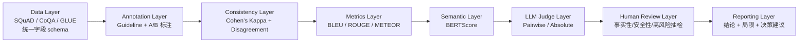

## Executive Summary

本报告总结 Day42 最终项目：将前序迭代中分散的评测能力（数据、标注、一致性分析、自动指标、语义指标、LLM Judge）整合为一个可复用、可扩展、可解释的 **AI Evaluation Pipeline 最小原型**。本项目的关键结论不是“某个指标最好”，而是：

- 生成式 AI 评测已经从“单指标打分”进入“系统工程”。
- 单一指标无法覆盖质量全貌，必须使用多层评测（overlap + semantic + judge + human）。
- 评测结果不应被当成绝对真值，而应被当成“可审计证据链”。

在开放生成任务中，BLEU/ROUGE 等 overlap 指标可以提供低成本、可批量的基线，但无法充分反映帮助性、推理完整性、事实正确性与安全性。BERTScore 可补语义相似，但“语义相似 ≠ 事实正确”。LLM Judge 能更接近人类偏好，但存在 position bias、verbosity bias、style bias、self-enhancement bias 等结构性偏差。因此，现代评测必须落在“自动化 + 人工兜底”的组合策略上。

---

## Project Scope & Evaluation Pipeline

本项目覆盖的范围不是某个模型或某个指标的 isolated 实验，而是从样本组织到报告产出的闭环评测链路。

### Pipeline 全链路

### 设计目标

- **可落地**：能在真实项目中低成本运行，而非仅用于演示。
- **可扩展**：后续可接入更多任务类型、更多 Judge 策略、更多数据源。
- **可复用**：统一字段与分层逻辑，便于后续批次复跑。
- **可解释**：每个评分结论都能追溯来源与边界。

### 非目标（本报告刻意不做）

- 不宣称“某指标可替代人工判断”。
- 不将教学示例包装成真实生产实验结论。
- 不构造不存在的线上 API 或超范围 benchmark 结果。

---

## Data & Task Design

### 数据来源与任务覆盖

本项目采用三类常见数据来源进行方法论对齐：

- **SQuAD**：偏阅读理解与短答案 QA。
- **CoQA**：偏对话式 QA 与上下文连贯回答。
- **GLUE**：偏文本理解/分类与句对任务。

三者组合的意义：

- 覆盖“短答案”“对话生成”“判别任务”三类不同输出形态。
- 帮助验证同一评测框架在不同 task type 下的适配边界。
- 避免将“某一类任务表现”误认为“通用能力”。

### 统一字段设计（Schema）

| 字段 | 含义 | 作用 |
|---|---|---|
| `sample_id` | 样本唯一 ID | 保证可追溯、可复盘 |
| `source_dataset` | 来源数据集 | 支持跨数据集分组分析 |
| `task_type` | QA / generation / classification | 决定指标组合策略 |
| `input` | 模型输入 | 保证复现实验上下文 |
| `reference` | 参考答案/标签 | 支撑 overlap 与语义比较 |
| `difficulty_tag` | 难度标签 | 支持误差分层分析 |
| `split` | train/dev/check | 支持流程分工与验证 |

### 数据设计原则

- **先可比，再丰富**：优先保证样本结构统一，再追求规模扩张。
- **先代表性，再全面性**：MVP 阶段追求可解释抽样，不追求全覆盖。
- **先审计，再自动化**：任何自动打分都需要可回查到原始样本。

---

## Annotation & Agreement

标注层不是附属环节，而是决定评测可信度的地基。

### 标注闭环组件

- 标注 guideline（标签定义、正反例、边界样本、冲突裁决规则）
- 双标注员（Annotator A / Annotator B）
- disagreement 记录与分类
- 一致性统计（Cohen’s Kappa）
- guideline 迭代修订

### 为什么 Kappa 必须出现

Cohen’s Kappa 的核心价值在于：

- 区分“偶然一致”和“真实一致”。
- 帮助识别“规则不清导致的分歧”，而不是将所有分歧归因到模型。

> 核心方法论：**低一致性可能是规范问题，而不是模型问题。**

### disagreement 分类建议（教学型）

| 分歧类型 | 常见表现 | 可能根因 | 修复动作 |
|---|---|---|---|
| 标签定义歧义 | 同一样本被打到相邻标签 | 定义过宽/描述过抽象 | 重写标签边界 + 举反例 |
| 证据跨度不一致 | A 看局部，B 看全段 | 标注单位未统一 | 强制最小证据单元 |
| 任务理解偏差 | 一个按事实性打分，一个按表达性 | 维度混用 | 拆分多维标签 |
| 风格偏好冲突 | 正式文风与口语文风评分差异 | 无风格容忍规则 | 增加 style 容忍条款 |

### 标注层结论

- 标注规范是评测质量放大器；规范模糊会污染后续所有层（指标、Judge、报告）。
- 一致性分析应被视作“流程健康度指标”，不是一次性附录。

---

## Automatic Metrics Layer

本层目标不是“求单一最高分”，而是建立**低成本、可批量、可监控**的第一道质量筛查。

### 指标定位与边界总表

| 指标 | 更适合 | 不适合 | 核心边界 |
|---|---|---|---|
| BLEU | 翻译、模板稳定输出 | 开放式长回答 | 强依赖词面重合，惩罚表达多样性 |
| ROUGE | 摘要、信息覆盖任务 | 语义改写强的文本 | recall 导向，可能高覆盖低可读 |
| METEOR | 词形变化、近义表达 | 深层推理与事实检验 | 仍以词级对齐为主，不看真伪 |
| BERTScore | 开放生成、语义匹配 | 事实性与安全性判定 | 语义相似不保证事实正确 |

### BLEU

**适合**：

- 翻译/模板化回答
- wording 稳定的场景

**不适合**：

- 一问多答的开放任务
- 长推理过程

**边界提醒**：

- 高 BLEU 可能只是“表述接近”，不代表解释完整。

### ROUGE

**适合**：

- 摘要与关键信息覆盖评估
- recall-heavy 任务

**不适合**：

- 对语言自然度、逻辑结构要求高的场景

**边界提醒**：

- 高 ROUGE 可能由“堆砌关键词”获得，不代表可读性好。

### METEOR

**适合**：

- 允许一定改写的任务
- 对词形变化敏感的比较

**不适合**：

- 需要跨句逻辑与事实校验的任务

**边界提醒**：

- 比 BLEU/ROUGE 更柔性，但仍非“质量真值”。

### BERTScore

**适合**：

- 语义相似检验
- 多表达并存的开放任务

**不适合**：

- 事实正确性、安全性、可执行性直接判断

**边界提醒**：

- **semantic similarity ≠ factual correctness**。

### 本层方法论结论

- **overlap ≠ quality**：词面重合度无法覆盖用户真实体验。
- 自动指标适合做“批量筛查 + 趋势监控”，不适合独立决策。

---

## LLM Judge Layer

Judge 层用于补足传统指标无法捕获的维度：帮助性、解释性、指令遵循、推理完整度等。

### Judge 设计要素

- **Prompt**：明确角色、评分标准、输出格式。
- **输入结构**：Question + Candidate(s) + 评分 rubric。
- **输出结构**：分数/胜负 + 简短理由 + 置信描述（可选）。
- **模式选择**：Pairwise（A/B 比较）与 Absolute（单答打分）。

### Pairwise vs Absolute

| 模式 | 优势 | 风险 | 适用场景 |
|---|---|---|---|
| Pairwise | 相对稳定、便于排序 | 可能受候选顺序影响 | 模型对比、A/B 测试 |
| Absolute | 可跨批次积累评分 | 评分尺度漂移 | 单模型质量监控 |

### 与 OpenCompass / MT-Bench / FastChat 的关系

- **OpenCompass**：偏统一评测框架与组织能力。
- **MT-Bench**：偏开放式对话评测范式参考。
- **FastChat**：偏训练/服务/评测生态实践。

本项目的定位并非复刻上述系统，而是吸收其理念：

- 结构化评测输入输出
- 可追溯评测流程
- 可扩展评测组件

### Judge 教学型案例

**Question**：Explain what overfitting means.

**Candidate A**：Overfitting means memorizing training data.

**Candidate B**：Overfitting occurs when a model learns noise and training-specific patterns that reduce generalization ability.

**Judge Decision（示例）**：

- Winner：B
- Reason：B 同时覆盖定义、机制与泛化后果，信息完整度更高；A 只给出简化描述。

### Judge 层结论

- Judge 更接近人类偏好，但并非客观真值机。
- Judge 的价值在“补维度”，不是“替代所有维度”。

---

## Multi-layer Evaluation Results（定性综合）

> 说明：本节采用教学型综合分析，不伪造真实数值实验。

### 为什么必须多层评测

单层评测的典型失败方式：

- 只看 overlap：忽略语义改写与表达质量。
- 只看 semantic：忽略事实真伪与风险。
- 只看 judge：忽略 judge 偏差与稳定性。
- 只看人工：成本过高、吞吐受限。

### 多层互补框架

| 评测层 | 解决的问题 | 无法单独解决的问题 |
|---|---|---|
| Overlap Metrics | 大规模快速筛查 | 开放表达质量、事实性 |
| Semantic Metrics | 语义贴近度 | 幻觉与安全风险 |
| LLM Judge | 偏好与任务完成度 | 偏差控制、稳定性 |
| Human Review | 事实与风险兜底 | 规模化效率 |

### disagreement case（教学示例）

**示例场景**：

- 文本 A 与 reference 词面相似度低（BLEU/ROUGE 低）
- 语义保持较高（BERTScore 高）
- Judge 给出较高帮助性评分
- 人工复核发现：其中一个关键事实年份错误

**结论**：

- 自动层与 judge 层均可“看起来不错”，但 factuality 仍需人工 gate。
- 这正是“自动化 + 人工结合”的必要性证据。

### 决策建议（面向工程落地）

- 日常批量回归：自动指标 + 语义指标主导。
- 模型版本上线前：加入 Judge A/B 对比。
- 高风险领域：必须人工抽检与升级审查。

---

## Discussion: Metric Boundaries & Judge Bias

### 指标边界（Metric Boundaries）

1. **BLEU/ROUGE/METEOR 的共同边界**
   - 更像“文本对齐信号”，不是“用户价值信号”。
2. **BERTScore 的核心边界**
   - 捕获语义接近，但无法保证事实一致。
3. **跨任务迁移边界**
   - 在 QA 有效的指标组合，不一定可直接迁移到代码生成或 agent tool-use。

### Judge Bias 必须显式管理

| Bias 类型 | 典型现象 | 风险 | 缓解策略 |
|---|---|---|---|
| Position Bias | 候选顺序影响胜负 | 排序结果失真 | 随机打乱顺序、多次投票 |
| Verbosity Bias | 更长回答更易获胜 | 奖励冗长而非有效 | 增加“简洁性”rubric |
| Style Bias | 偏好某种文风 | 压制任务适配表达 | 任务化风格标准 |
| Self-enhancement Bias | Judge 偏向与自身风格相近文本 | 模型同质偏见 | 多 Judge 交叉评审 |

### Judge 可靠性增强策略

- 固定评测模板与 rubric，减少 prompt 漂移。
- 关键样本使用多次评审与一致性统计。
- 建立 hard-case 池，持续回归评测。
- 对高影响决策引入人工仲裁机制。

---

## Limitations

本项目作为最小原型，存在以下明确局限：

1. **数据规模有限**：难以覆盖全部语言现象与长尾错误。
2. **Benchmark coverage 不足**：当前任务类型仍有限，尚未全面覆盖真实工业场景。
3. **BERTScore 不等于 factuality**：语义近似可能掩盖事实错误。
4. **Judge 不稳定**：受提示、顺序、版本等因素影响。
5. **无法替代人工**：在事实性、安全性、合规性方面仍需人工兜底。
6. **报告以方法论总结为主**：不输出未经验证的量化结论。

---

## Future Work

### 任务与场景扩展

- **RAG evaluation**：检索质量、引用对齐、答案忠实度联合评估。
- **Hallucination detection**：构建幻觉标签体系与自动预警链路。
- **Agent evaluation**：工具调用正确性、步骤完成率、失败恢复能力。

### 评测系统扩展

- **Multi-judge ensemble**：多 Judge 聚合以降低单评审偏差。
- **CI evaluation**：把关键评测接入版本发布门禁。
- **Dashboard**：可视化趋势、分层告警、错误热区。
- **Dataset registry**：管理样本版本、标注版本、评测版本。

### 方法论扩展

- 从“打分导向”转向“证据导向”。
- 从“平均分导向”转向“风险样本导向”。
- 从“离线评测”转向“持续评测 + 反馈回路”。

---

## Conclusion

### 是否已形成最小 AI Evaluation Prototype？

**答案：是。**

本项目已形成一个覆盖 Data → Annotation → Consistency → Metrics → Semantic → Judge → Human Review → Reporting 的完整最小评测原型。它具备以下工程意义：

- 提供可重复执行的评测主干流程。
- 明确每层评测信号的价值与边界。
- 建立自动化效率与人工可靠性的平衡机制。
- 为后续平台化（CI、Dashboard、Registry、Multi-judge）奠定结构基础。

最终方法论结论：

1. 现代 LLM 评测不是“单指标问题”，而是“系统化工程问题”。
2. 多层评测不是冗余，而是对不同失真风险的分层防御。
3. Judge 是重要增量能力，但必须在偏差治理与人工兜底下使用。
4. 可靠评测的目标不是追求一个完美分数，而是构建可解释、可审计、可持续演进的评价体系。
